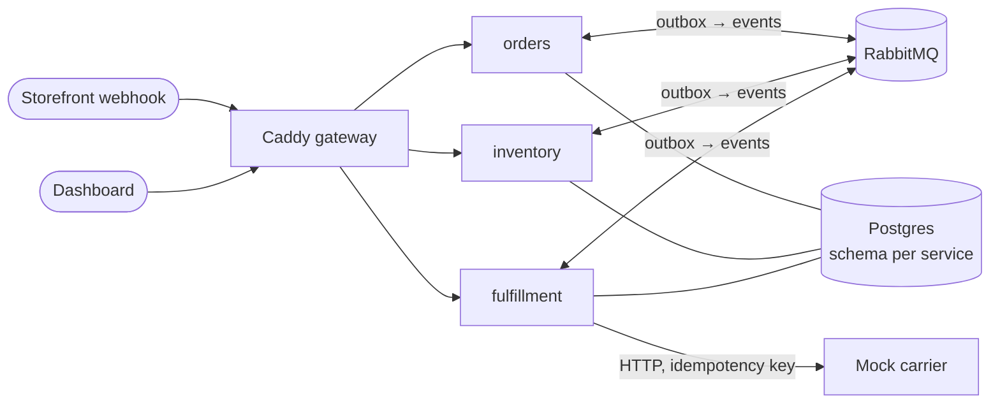

# Stockroom

Event-driven inventory and fulfillment for a fictional online game store: base games,
expansion packs and accessories, stocked in more than one warehouse.

The problem it solves is **not selling what is not there**, even with concurrent
orders, duplicated webhooks and services failing mid-flow. What it guarantees, and
where each guarantee is proven:

| Guarantee | Proof |
|---|---|
| 200 concurrent orders for 50 units: exactly 50 get stock, availability never goes below zero | `tests/integration/test_reservation_concurrency.py`, `scripts/load_test.py` |
| The same webhook delivered 3 times creates one order | `tests/integration/test_order_webhook.py` |
| A service stopped mid-flow loses and duplicates nothing when it comes back | `tests/integration/test_messaging_e2e.py`, demo 4 below |
| A carrier that keeps failing ends in a cancelled order with its stock released | `tests/integration/test_fulfillment_flow.py` |

Python 3.13, FastAPI, Postgres, RabbitMQ, Docker Compose and Caddy.

## Architecture



| Service | Owns |
|---|---|
| `inventory` | Stock as an append-only ledger, reservations with TTL |
| `orders` | Idempotent order webhook, order state machine and history |
| `fulfillment` | Picking, carrier dispatch with retries, compensation |
| `carrier` | A mock shipping carrier that fails on purpose |

The services share one Postgres instance, but each owns its own schema. They talk
only through events:

```text
orders       order.placed        → inventory    reserve            → stock.reserved | stock.rejected
inventory    stock.reserved      → orders       reserved           → order.reserved
orders       order.reserved      → fulfillment  pick and pack      → fulfillment.picked
fulfillment  fulfillment.picked  → inventory    pin the hold (no more TTL)
                                 → orders       picked
fulfillment  (dispatcher)        → carrier      book               → fulfillment.shipped | failed
fulfillment  fulfillment.shipped → inventory    stock leaves the ledger
                                 → orders       shipped + tracking number
fulfillment  fulfillment.failed  → orders       cancel             → order.cancelled
orders       order.cancelled     → inventory    release the hold
                                 → fulfillment  stop the shipment
```

Every event is written to the sender's `outbox` table in the same transaction as the
change that caused it, then relayed to RabbitMQ. Every consumer records the event id
before acting, so redeliveries are no-ops. Failures retry with a delay, then go to a
dead-letter queue.

## Run it

Requires Docker.

```sh
docker compose up -d --build
```

Open **<http://localhost:8100>**: stock per warehouse, recent orders and each order's
timeline, with controls to place orders, send a burst and make the carrier fail. Each
API is under `/api/<service>`, with docs at `/api/<service>/docs`.

## Demos

### 1. An order through its whole lifecycle

```sh
curl -X POST localhost:8100/api/orders/webhooks/orders \
  -H 'Idempotency-Key: demo-1' -H 'Content-Type: application/json' \
  -d '{"id": 1001, "line_items": [{"sku": "CORE-001", "quantity": 2}]}'
curl localhost:8100/api/orders/orders/<id>     # pending → reserved → picked → shipped
```

### 2. 200 concurrent orders for 50 units

```sh
uv run python scripts/load_test.py
```

```text
  [PASS] orders that got stock: 50, expected 50
  [PASS] lowest availability seen: 0
  [PASS] every order settled: yes
  [PASS] stock left the ledger once per shipment: on hand 50 -> 0 for 50 shipped
```

### 3. The same webhook three times

Repeat the request from demo 1: the same order
comes back with `Idempotent-Replayed: true`. The same key with a different body
answers 422.

### 4. Stop fulfillment mid-flow

```sh
docker compose stop fulfillment
# place a few orders: they are reserved, and their events wait in the queue
docker compose start fulfillment
# every order ships exactly once, one tracking number each
```

### 5. A carrier that keeps failing

Set the failure rate to 100% (dashboard, or
`PUT /api/carrier/admin/behaviour`). New orders retry with backoff, then end
`cancelled / carrier_failed`, and their stock is available again.

## Develop

Requires [uv](https://docs.astral.sh/uv/).

```sh
uv sync
uv run pre-commit install
docker compose up -d postgres rabbitmq    # integration tests use the real thing
uv run pytest
```

Unit tests need nothing. Integration tests use real Postgres, because only a real
database can prove row locking, and real RabbitMQ for retries and dead-lettering. CI
runs both as service containers.

```text
src/stockroom/
  shared/        outbox, relay, idempotent consumer, migrations, settings
  inventory/     ledger, reservations, event handlers
  orders/        webhook, state machine, event handlers
  fulfillment/   shipments, dispatcher, carrier client
  carrier/       the mock carrier
dashboard/       static dashboard (no build step)
gateway/         Caddy configuration, local and production
scripts/         load test
```

Each service follows the same shape: `domain.py` holds pure rules with no I/O,
`repository.py` holds SQL, `service.py` holds transactions, and `handlers.py` and
`api.py` are the edges.

## Design decisions

- [ADR 0001: Stock as an append-only ledger](docs/adr/0001-stock-as-an-append-only-ledger.md)
- [ADR 0002: Row lock per stock item for reservations](docs/adr/0002-row-lock-per-stock-item-for-reservations.md)
- [ADR 0003: Transactional outbox and idempotent consumers](docs/adr/0003-transactional-outbox-and-idempotent-consumers.md)
- [ADR 0004: Carrier dispatch and compensation](docs/adr/0004-carrier-dispatch-and-compensation.md)
- [ADR 0005: RabbitMQ over Kafka](docs/adr/0005-rabbitmq-over-kafka.md)
- [ADR 0006: Three services, and why a modular monolith would be the honest default](docs/adr/0006-three-services-and-the-modular-monolith.md)

## Not done, on purpose

- **Warehouse allocation.** Orders name their warehouse or fall back to a default.
  Choosing one by stock and distance is the next inventory feature.
- **Webhook signatures.** A real storefront signs its webhooks (HMAC). Here the
  Idempotency-Key is required but the body is not authenticated.
- **Balance snapshots.** Balances are summed from the ledger on read. That is fine at
  this size; periodic snapshots would keep reads constant as the ledger grows.
- **Observability.** Logs only. Tracing across the event chain (a correlation id on
  every event) would be first on a real system.

## Deployment

See [docs/deploy.md](docs/deploy.md): one VPS, the same Compose file plus a production
override, and Caddy for HTTPS.
